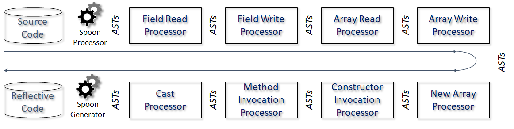

# Reflectator

Reflectator is a command-line tool that transforms Java source code into an equivalent reflective version. It uses [Spoon](https://spoon.gforge.inria.fr/) to parse Java source files, traverse their abstract syntax tree (AST), and produce transformed Java source code ready to be compiled.

The tool is organized as a chain of Spoon processors. Each processor receives an AST, transforms one specific Java syntactic construct into its reflective equivalent, and passes the resulting AST to the next processor. Processors can be enabled selectively, so the same input program can be transformed with different levels of reflection.

## Architecture



Reflectator always runs a small set of base processors that add support code and normalize the transformed classes. Optional processors can then transform field reads, field writes, array operations, casts, method invocations, constructor invocations, and new array expressions.

The generated output also includes an `introspector.IntrospectorHelper` helper class used by some transformations, especially numeric unary operations.

## Prerequisites

Reflectator requires:

* Java 21 or higher.
* Maven 3.x.

The project builds a shaded executable JAR that includes Spoon.

## Build

To build Reflectator, run:

```bash
mvn package
```

The executable JAR is generated at:

```bash
target/reflectator-1.0.0.jar
```

## Usage

Run Reflectator with a source folder and an output folder:

```bash
java -jar target/reflectator-1.0.0.jar -source path/to/source -out path/to/output
```

Reflectator writes the transformed source code into an `RF*` subfolder inside the output folder. For example, if the output folder is `out`, the default generated folder is:

```bash
out/RF
```

Optional transformations change the generated folder name. For example, using `-fr -mi` writes into `RF-fr-mi`.

## Options

* `-help`, `--help`, `-?` Display the command-line help.
* `-source <source_folder>`, `--source <source_folder>`, `-s <source_folder>` Source folder to process. Also accepts `-source=<source_folder>`.
* `-out <output_folder>`, `--out <output_folder>`, `-o <output_folder>` Base output folder. Reflectator writes into an `RF*` subfolder.
* `-exclude <class_name>`, `--exclude <class_name>`, `-x <class_name>` Class or package to exclude from reflection. Can be repeated.
* `-c` Transform casts into reflective `Class.cast(...)` calls.
* `-fr` Transform field reads into reflective field access.
* `-fw` Transform field writes into reflective field updates.
* `-ar` Transform array reads into reflective array access.
* `-aw` Transform array writes into reflective array updates.
* `-na` Transform new array expressions into reflective array creation.
* `-ci` Transform constructor calls into reflective constructor invocations.
* `-mi` Transform method calls into reflective method invocations.
* `-full` Enable all optional transformations.
* `<class_name> [<class_name> ...]` Restrict transformation to the listed classes. Fully qualified names and `.java` file names are accepted.

## Examples

Transform a project with the base processors only:

```bash
java -jar target/reflectator-1.0.0.jar -s examples/MyProject/src -o generated
```

Transform field reads and method invocations:

```bash
java -jar target/reflectator-1.0.0.jar -s examples/MyProject/src -o generated -fr -mi
```

Transform all supported constructs:

```bash
java -jar target/reflectator-1.0.0.jar -s examples/MyProject/src -o generated -full
```

Transform only selected classes:

```bash
java -jar target/reflectator-1.0.0.jar -s examples/MyProject/src -o generated -full com.example.Service com.example.Model.java
```

Exclude a package or class from the transformation:

```bash
java -jar target/reflectator-1.0.0.jar -s examples/MyProject/src -o generated -full -x com.example.generated -x LegacyClass
```

## Transformations

Reflectator supports the following optional transformations:

| Option | Processor | Transformation |
| --- | --- | --- |
| `-c` | `Cast` | Replaces non-primitive casts with reflective `Class.cast(...)` calls. |
| `-fr` | `FieldRead` | Replaces instance, static, inherited, and array-length field reads with reflective access. |
| `-fw` | `FieldWrite` | Replaces instance, static, and inherited field writes with reflective updates. |
| `-ar` | `ArrayRead` | Replaces array reads with `java.lang.reflect.Array.get(...)`. |
| `-aw` | `ArrayWrite` | Replaces array writes with `java.lang.reflect.Array.set(...)`. |
| `-na` | `NewArrayInvocation` | Replaces new array expressions with reflective array creation. |
| `-ci` | `ConstructorInvocation` | Replaces constructor calls with `Class.forName(...).getConstructor(...).newInstance(...)`. |
| `-mi` | `MethodInvocation` | Replaces instance, static, and super method calls with reflective invocation. |

The base processors are always enabled. They add helper methods, wrap generated reflective statements when needed, and process method, constructor, class, unary-expression, assignment, try/catch, and block constructs required by the transformation pipeline.

## License

[MIT license](LICENSE)
